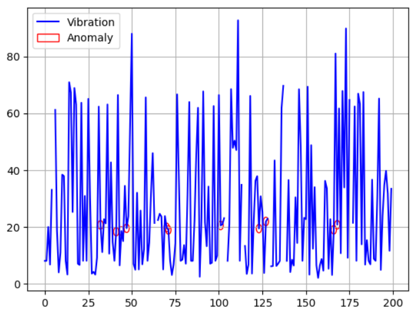

# anomaly-detection
In this project, I developed a system to detect anomalies in elevator performance by analyzing time series data collected from five sensors. To achieve this, I used a U-Net architecture combined with LSTM layers. This approach helps predict relationships within the sensor data, allowing for the identification of unusual patterns that may indicate issues with elevator quality.

After training my model, I performed anomaly detection by comparing the prediction loss with a threshold, calculated as the sum of the mean and twice the standard deviation of the loss values. By projecting these values onto a vibration diagram, I observed that the gradient sign changed suddenly at the points of detected anomalies. This indicates that the model successfully identified abnormal behavior in the elevator's performance.

Dataset: [shivamb/elevator-predictive-maintenance-dataset](https://www.kaggle.com/datasets/shivamb/elevator-predictive-maintenance-dataset)